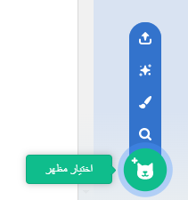

انقر فوق علامة تبويب ** المظاهر** للكائنات.

**نصيحة:** قم بتكرار المظهر الذي تريد تعديله - بحيث لا يزال بإمكانك استخدام المظهر الأصلي إذا كنت بحاجة إلى ذلك. للقيام بذلك، انقر بزر الماوس الأيمن (أو على جهاز لوحي، انقر مع الاستمرار) على المظهر واختر **مضاعفة**. سيكون لديك الآن نسخة من المظهر:


لإزالة أي جزء من المظهر لم تعد بحاجة إليه، انقر فوق الجزء لتحديده، ثم انقر فوق **حذف**:


يجب أن يبدو المظهر المكرر مع إزالة الأجزاء كما يلي:


**نصيحة:** إذا قمت بخطأ ما في محرر الرسام ، يمكنك النقر فوق **تراجع**: 

انتقل إلى المظهر الذي يحتوي على الجزء الذي تريد إضافته وانقر على الجزء الذي تريده ، ثم انقر فوق **نسخ**:


إذا كنت ترغب في إضافة جزء من مظهر لم يتم عرضه بالفعل في **مظاهر**، فأنت بحاجة إلى إضافة المظهر إلى الكائن الخاص بك أولاً. انقر على **اختيار مظهر**، ثم ابحث عن المظهر الذي تريده وانقر عليه لإضافته إلى كائنك:



عندما تنسخ الجزء الذي تريده، ارجع إلى المظهر المكرر وانقر على **لصق**. يجب أن يبدو المظهر المكرر الآن كما يلي:


الآن، قم بالتبديل إلى علامة التبويب **المقاطع البرمجية**. ستتمكن من استخدام المظهر الجديد في التعليمات البرمجية الخاصة بك:

```blocks3
switch costume to [nano-a2 v] // the edited costume
```
