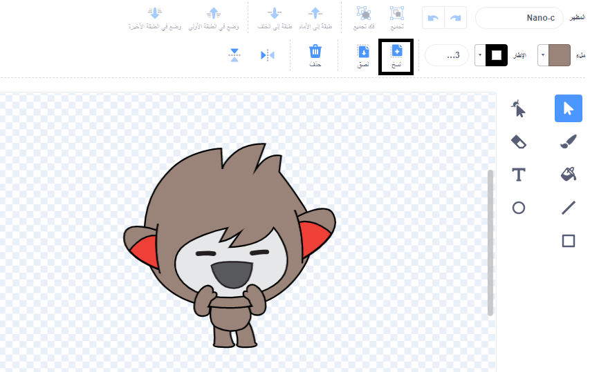

انقر فوق علامة تبويب ** المظاهر** للكائنات.

**نصيحة:** قم بتكرار المظهر الذي تريد تعديله - بحيث لا يزال بإمكانك استخدام المظهر الأصلي إذا كنت بحاجة إلى ذلك. للقيام بذلك، انقر بزر الماوس الأيمن (أو على جهاز لوحي، انقر مع الاستمرار) على المظهر واختر **مضاعفة**. سيكون لديك الآن نسخة من المظهر:


لإزالة أي جزء من المظهر لم تعد بحاجة إليه، انقر فوق الجزء لتحديده، ثم انقر فوق **حذف**:


يجب أن يبدو المظهر المكرر مع إزالة الأجزاء كما يلي:


**نصيحة:** إذا قمت بخطأ ما في محرر الرسام ، يمكنك النقر فوق **تراجع**: 

انتقل إلى المظهر الذي يحتوي على الجزء الذي تريد إضافته وانقر على الجزء الذي تريده ، ثم انقر فوق **نسخ**:



If you want to add a part from a costume that is not already shown in the **Costumes** tab, you need to add the costume to your sprite first. انقر على **اختيار مظهر** ، ثم ابحث عن المظهر الذي تريده وانقر عليه لإضافته إلى كائنك:


When you have copied the part that you need, go back to the duplicated costume and click on **Paste**. The duplicated costume should now look something like this:


Now, switch to the **Code** tab. You will be able to use the new costume in your code blocks:

```blocks3
switch costume to [nano-a2 v] // the edited costume
```
