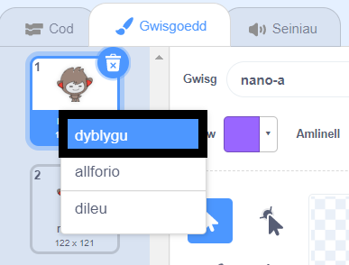
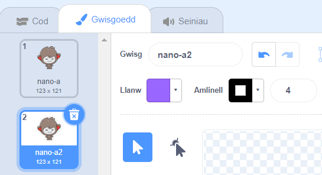
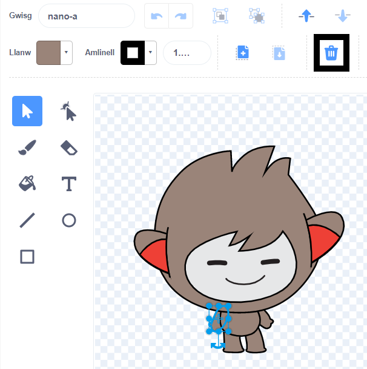
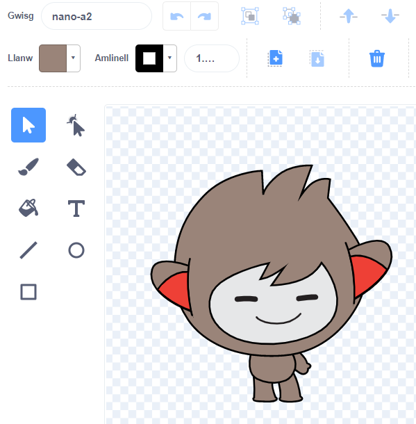
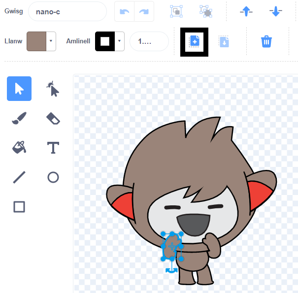
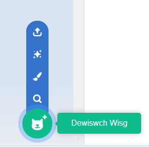
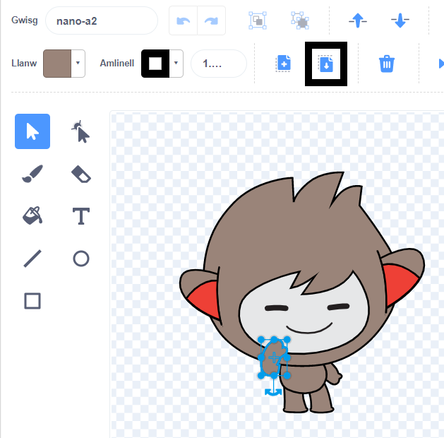

Clicia'r tab **Gwisgoedd** ar gyfer dy gorlun.

**Awgrym:** Dyblyga'r wisg rwyt ti am ei golygu - fel y galli di ddefnyddio'r wisg wreiddiol o hyd os oes angen. I wneud hyn, de-glicia (neu ar dabled, taro a dal) ar y wisg a dewis **dyblygu**. Nawr bydd gen ti gopi o'r wisg:





I gael gwared ar unrhyw ran o'r wisg nad wyt ti ei hangen mwyach, clicia ar y rhan honno i'w dewis, wedyn clicio ar **Dileu**:



Dylai'r wisg ddyblyg gyda rhannau wedi'i thynnu edrych rhywbeth fel hyn:



**Awgrym:** Os byddi di'n gwneud camgymeriad yn y Golygydd paent, galli di glicio **Dad-wneud**: 

Cer i'r wisg sydd â'r rhan rwyt ti am ei hychwanegu a chlicio ar y rhan rwyt ti ei hangen, wedyn clicio ar **Copïo**:



Os wyt ti am ychwanegu rhan o wisg sydd ddim yn cael ei dangos yn y tab **Gwisgoedd** yn barod, mae angen i ti ychwanegu'r wisg at dy gorlun yn gyntaf. Clicia ar yr eicon **Dewiswch Wisg**, wedyn edrycha am y wisg rwyt ti ei heisiau a chlicio arni i'w hychwanegu at dy gorlun:



Pan fyddi di wedi copïo'r rhan rwyt ei heisiau, cer yn ôl at y wisg ddyblyg a chlicio ar **Gludo**. Dylai'r wisg ddyblyg edrych rhywbeth fel hyn nawr:



Nawr, newidia i'r tab **Cod**. Byddi di'n gallu defnyddio'r wisg newydd yn dy flociau cod:

```blocks3
switch costume to [nano-a2 v] // the edited costume
```
