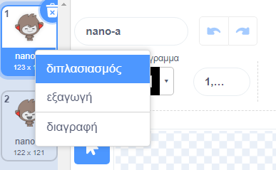
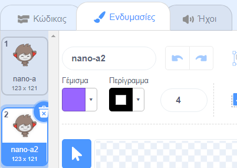
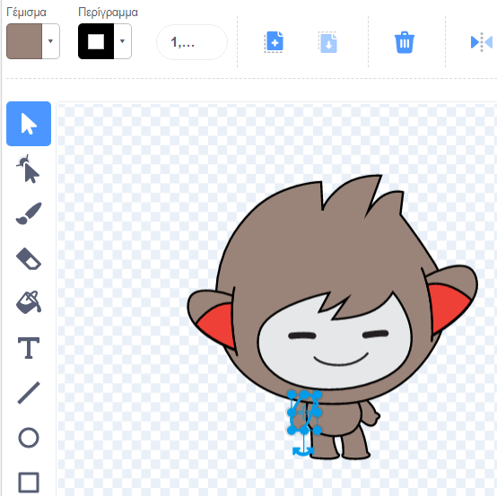
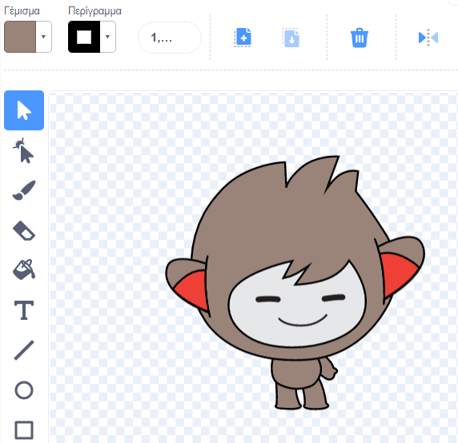
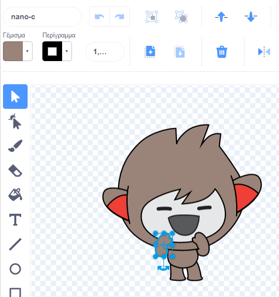
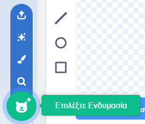
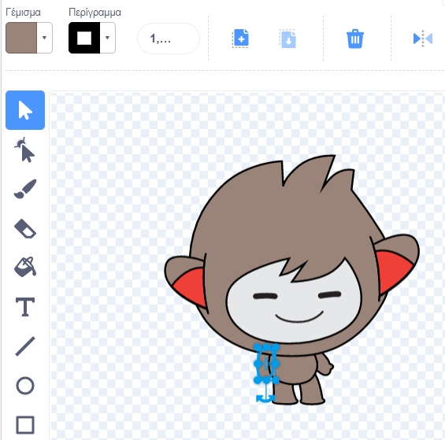

Κάνε κλικ στην καρτέλα **Ενδυμασίες** για το αντικείμενό σου.

**Συμβουλή:** Διπλασίασε την ενδυμασία που θέλεις να επεξεργαστείς - ώστε να μπορείς να χρησιμοποιήσεις το πρωτότυπο εάν χρειάζεται. Για να το κάνεις αυτό, κάνε δεξί κλικ (ή σε tablet, πατήστε παρατεταμένα) στο κοστούμι και επίλεξε **διπλότυπο**. Τώρα θα έχεις ένα αντίγραφο της ενδυμασίας:





Για να αφαιρέσεις τυχόν περιοχές της ενδυμασίας που δεν χρειάζεσαι πλέον, κάνε κλικ στο μέρος για να το επιλέξεις και κάνε κλικ στη **Διαγραφή**:



Η δεύτερη ενδυμασία με τα μέρη που έχουν αφαιρεθεί θα μοιάζει ως εξής:



**Συμβουλή:** Εάν κάνεις λάθος στον επεξεργαστή εικόνας, μπορείς να κάνεις κλικ στην επιλογή **Αναίρεση**: 

Πήγαινε στην ενδυμασία με το μέρος που θέλεις να προσθέσεις και κάνε κλικ στο μέρος που χρειάζεσαι και, στη συνέχεια, κάνε κλικ στην **Αντιγραφή**:



Εάν θέλεις να προσθέσεις ένα μέρος από ένα κοστούμι που δεν εμφανίζεται ήδη στην **Κοστούμια**, πρέπει πρώτα να προσθέσεις το κοστούμι στο sprite σου. Κάνε κλικ στο **Επίλεξε ένα κοστούμι** και, στη συνέχεια, βρες το κοστούμι που θέλεις και κάνε κλικ σ΄ αυτό για να το προσθέσεις στο sprite σου:



Όταν αντιγράψεις το μέρος που χρειάζεσαι, επέστρεψε στο διπλό κοστούμι και κάνε κλικ στο **Επικόλληση**. Η δεύτερη ενδυμασία θα μοιάζει ως εξής:



Τώρα, μεταβείτε στην καρτέλα **Κωδικός**. Θα μπορείς να χρησιμοποιήσεις τη νέα φορεσιά στα μπλοκ κωδικών σου:

```blocks3
switch costume to [nano-a2 v] // the edited costume
```
