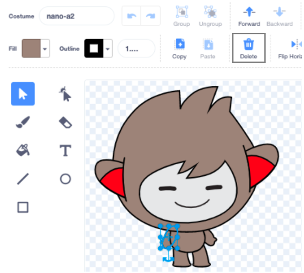
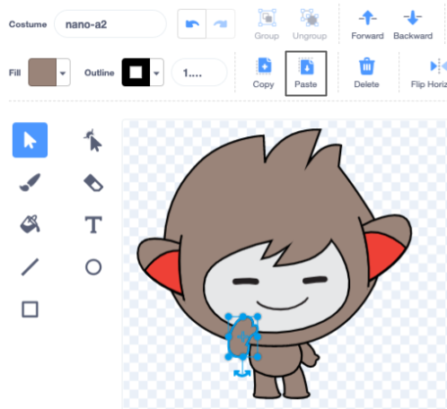

Click on the **Costumes** tab for your sprite:


**Tip:** Duplicate the costume that you want to edit — so that you can still use the original costume if you need to. Right-click (or on a tablet, tap and hold) on the costume and choose **duplicate**. You will now have a second copy of the costume.


To remove any areas of the costume that you do not need any more, click on the part to select it, then click on **Delete**.



The duplicated costume with parts removed should look something like this:


**Tip:** If you make a mistake in the Paint editor, you can click on **Undo**. 

Go to the costume with the detail that you want to add and click on the part that you need, then click on **Copy**.


If you want to add a costume that is not already shown in the **Costumes** tab, click the **Choose a Costume** button. Then, find the costume that you want and click on it to add it to your sprite. 


Go back to the duplicated costume and click on **Paste**. The duplicated costume should look something like this:



Now, switch to the **Code** tab. You will be able to use your new costume in your code blocks:

```blocks3
switch costume to [nano-a2 v] // the edited costume
```
