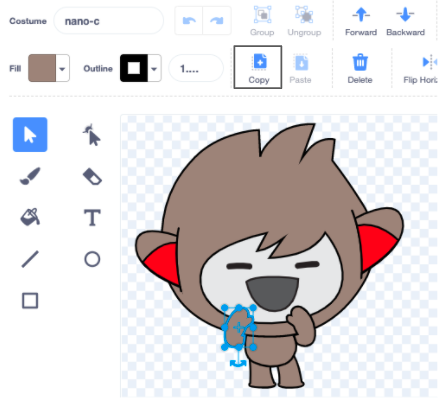

## Copy parts between sprite costumes

Click on the **Costumes** tab for your sprite:


--- /task ---

--- task ---

**Tip:** Duplicate the costume you want to edit, right-click (or tap and hold on a tablet) on the costume and choose 'duplicate'. You will now have a second copy of the costume - so you can still use the original if needed.


--- /task ---

--- task ---

To remove any areas of the costume you no longer need, click on the part to select it then click **Delete**.


The duplicated costume with parts removed should look something like this:


--- /task ---

**Tip:** If you make a mistake in the Paint editor you can click Undo 

--- task ---

Go to the costume with the detail you want to add and click on the part you need then click **Copy**.



If you want to add a costume not already shown in the **Costumes** tab, click on the **Choose a costume** button. Then find the costume you want and click on it to add it to your sprite. 


--- /task ---

--- task ---

Go back to the duplicated costume and click on **Paste**. The duplicated costume should look something like this:


--- /task ---

--- task ---

Now switch to the **Code** tab you will be able to use your new costume in your code blocks:

```blocks3
switch costume to [nano-a2 v] // the edited costume
```
--- /task ---
