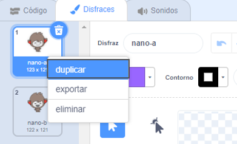
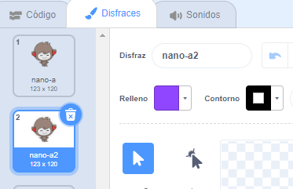
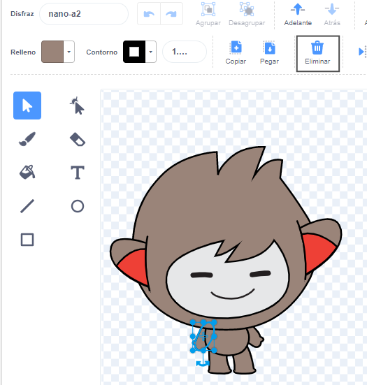
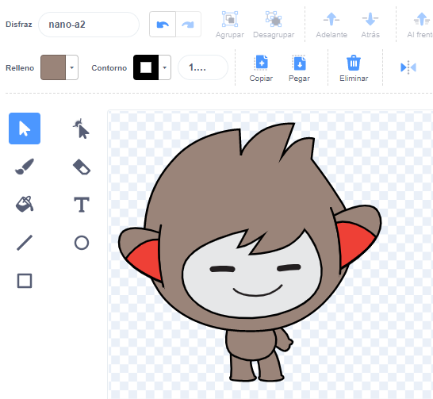
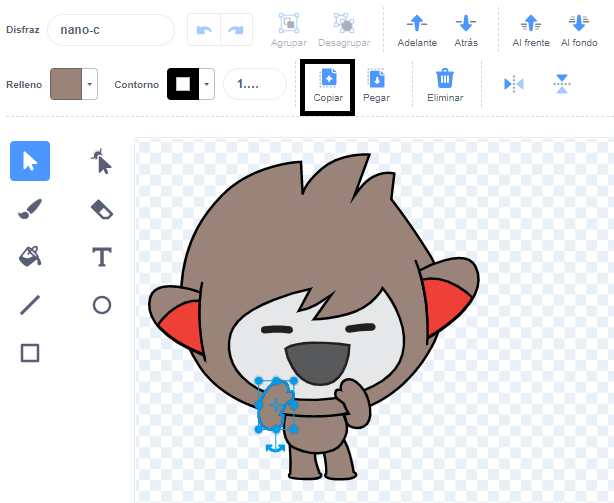
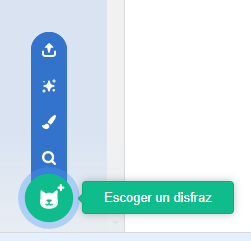
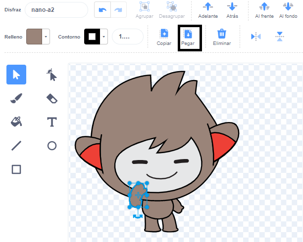

Haz clic en la pestaña **Disfraces** de tu objeto.

**Consejo:** Duplica el disfraz que quieres editar, para que puedas seguir usando el original si es necesario. Para hacer esto, haz clic derecho (o en una tableta, mantén presionado) en el disfraz y elige **duplicar**. Ahora tendrás una copia del disfraz:





Para eliminar cualquier área del disfraz que ya no necesites, haz clic en la parte para seleccionarla y luego haz clic en **Eliminar**:



El disfraz duplicado con partes removidas debería verse así:



**Consejo:** Si cometes un error en el editor de dibujos, puedes hacer clic en **Deshacer**: 

Ve al disfraz con el detalle que deseas agregar y haz clic en la parte que necesitas, luego haz clic en **Copiar**:



Si deseas agregar una parte de un disfraz que aún no se muestra en la pestaña **Disfraces**, primero debes agregar el disfraz a tu objeto. Haz clic en el ícono **Escoger un disfraz**, luego busca el disfraz que deseas y haz clic en él para agregarlo a tu objeto:



Cuando hayas copiado la parte que necesitas, vuelve al disfraz duplicado y haz clic en **Pegar**. El disfraz duplicado ahora debería verse así:



Ahora, cambia a la pestaña **Código**. Podrás usar el nuevo disfraz en tus bloques de código:

```blocks3
switch costume to [nano-a2 v] // the edited costume
```
