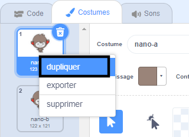
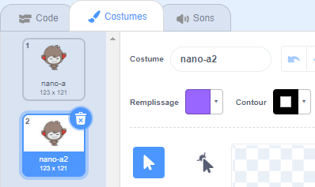
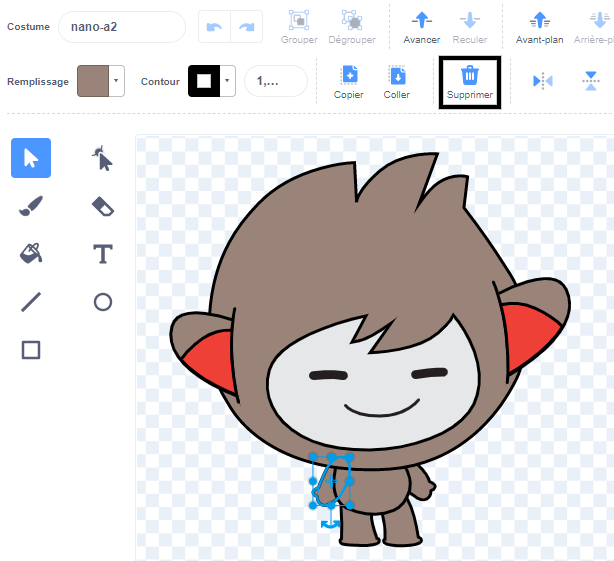
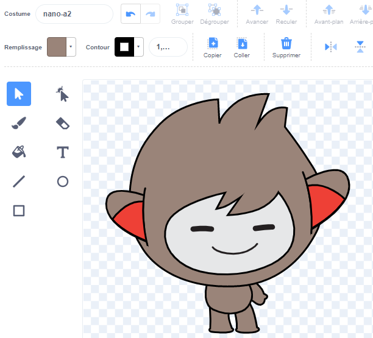
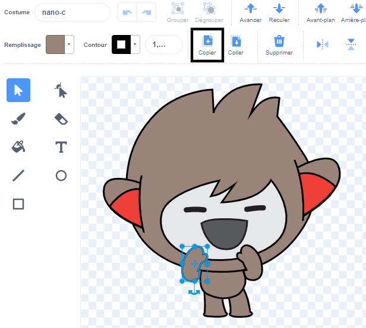
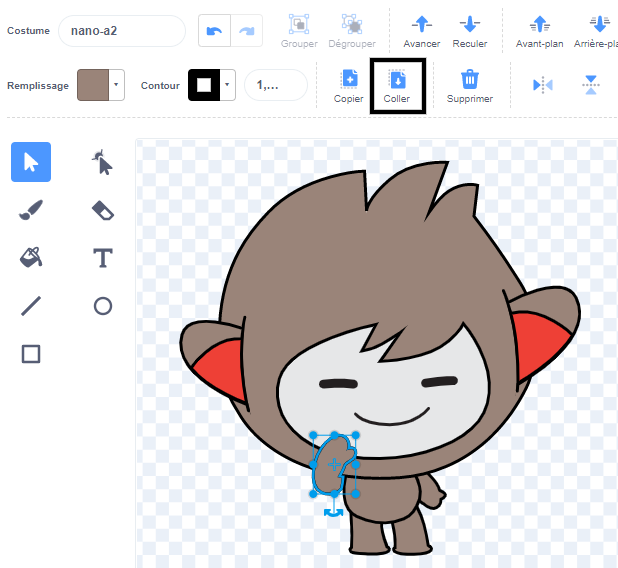

Clique sur l'onglet **Costumes** pour ton sprite.

**Tip:** Duplicate the costume that you want to edit — so that you can still use the original costume if you need to. To do this, right-click (or on a tablet, tap and hold) on the costume and choose **duplicate**. Tu auras maintenant une copie du costume :





To remove any part of the costume that you do not need any more, click on the part to select it, then click on **Delete**:



The duplicated costume with parts removed should look something like this:



**Astuce :** si tu fais une erreur dans l'éditeur de peinture, tu peux cliquer sur **Annuler** : 

Go to the costume with the part that you want to add and click on the part that you need, then click on **Copy**:



If you want to add a part from a costume that is not already shown in the **Costumes** tab, you need to add the costume to your sprite first. Click on the **Choose a Costume** icon, then find the costume that you want and click on it to add it to your sprite:


When you have copied the part that you need, go back to the duplicated costume and click on **Paste**. The duplicated costume should now look something like this:



Now, switch to the **Code** tab. You will be able to use the new costume in your code blocks:

```blocks3
switch costume to [nano-a2 v] // the edited costume
```
