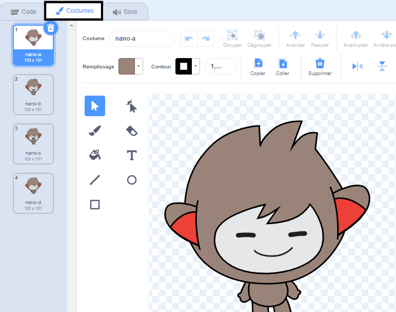

## Copier des parties entre les costumes de sprite

Clique sur l'onglet **Costumes** pour ton sprite :



**Astuce :** duplique le costume que tu souhaites modifier pour pouvoir toujours utiliser l'original si nécessaire. Clique avec le bouton droit de ta souris (ou appuie et maintiens ton doigt sur une tablette) sur le costume et choisis « dupliquer ». Tu auras maintenant une deuxième copie du costume.


Pour supprimer les zones du costume dont tu n'as plus besoin, clique sur la partie pour la sélectionner puis clique sur **Supprimer**.


Le costume dupliqué avec des parties supprimées devrait ressembler à ceci :


**Astuce :** si tu fais une erreur dans l'éditeur de peinture, tu peux cliquer sur Annuler 

Va au costume avec le détail que tu souhaites ajouter et clique sur la partie dont tu as besoin puis clique sur **Copier**.


Si tu souhaites ajouter un costume qui ne figure pas déjà dans l'onglet **Costumes** , clique sur le bouton **Choisir un costume**. Ensuite, trouve le costume que tu veux et clique dessus pour l'ajouter à ton sprite.


Reviens au costume dupliqué et clique sur **Coller**. Le costume dupliqué devrait ressembler à ceci :


Passe maintenant à l'onglet **Code**, tu pourras utiliser ton nouveau costume dans tes blocs de code :

```blocks3
switch costume to [nano-a2 v] // the edited costume
```
