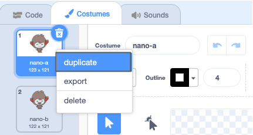
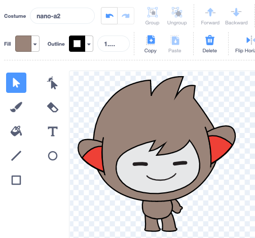
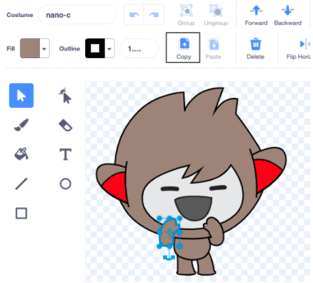

Click on the **Costumes** tab for your sprite.

**Tip:** Duplicate the costume that you want to edit — so that you can still use the original costume if you need to. To do this, right-click (or on a tablet, tap and hold) on the costume and choose **duplicate**. You will now have a copy of the costume:




To remove any part of the costume that you do not need any more, click on the part to select it, then click on **Delete**:


The duplicated costume with parts removed should look something like this:



**Tip:** If you make a mistake in the Paint editor, you can click on **Undo**: 

Go to the costume with the part that you want to add and click on the part that you need, then click on **Copy**:



If you want to add a part from a costume that is not already shown in the **Costumes** tab, you need to add the costume to your sprite first. Click on the **Choose a Costume** icon, then find the costume that you want and click on it to add it to your sprite:


When you have copied the part that you need, go back to the duplicated costume and click on **Paste**. डुप्लीकेट पोशाक अब कुछ इस तरह दिखनी चाहिए:


अब, **कोड** टैब पर क्लिक करें। You will be able to use the new costume in your code blocks:

```blocks3
switch costume to [nano-a2 v] // the edited costume
```
