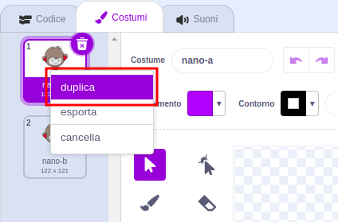
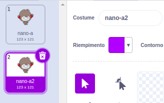
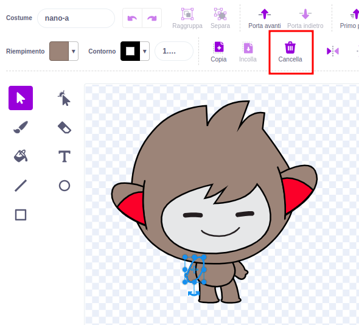
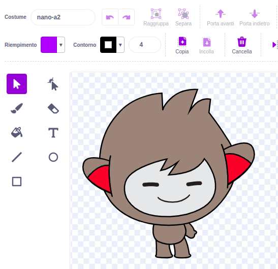
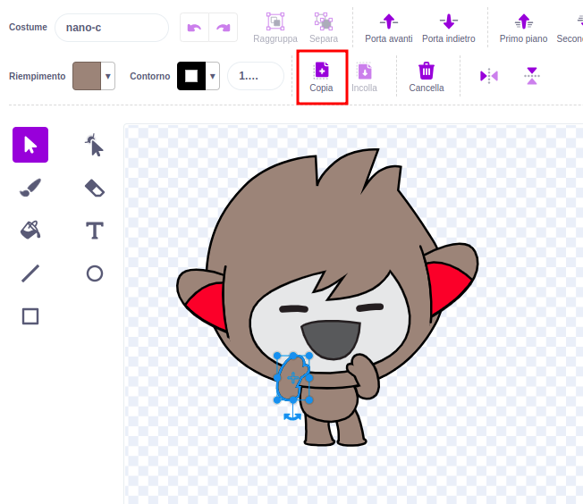
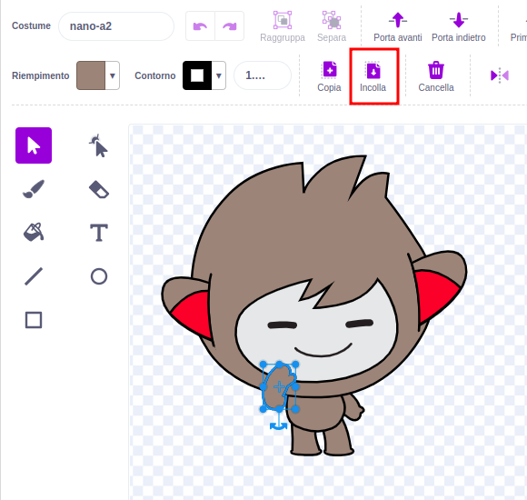

Clicca sulla scheda **Costumi** per la tua immagine.

**Suggerimento:** Duplicare il costume che si desidera modificare, in modo da poter continuare a usare il costume originale se necessario. Per farlo, clica con il tasto destro del mouse (o su tablet, tocca e tieni premuto) sul costume e sceglie **duplica**. Ora avrai una copia del costume:





Per rimuovere una parte del costume che non serve più, clicca sull'elemento per selezionarlo, quindi clicca su **Elimina**:



Il costume duplicato con gli elementi rimossi dovrebbe avere un aspetto simile a questo:



**Suggerimento:** Se si commette un errore nell'editor di Paint, è possibile cliccare su **Annulla**: 

Seleziona il costume con l'elemento che desideri copiare e clicca sulla parte desiderata, quindi clicca su **Copia**:



Se vuoi aggiungere una parte di un costume che non è presente nella scheda **Costumi**, è necessario aggiungere prima il costume allo sprite. Clicca sull'icona **Scegli un costume**, quindi trovare il costume desiderato e cliccalo per aggiungerlo all'immagine:


Una volta copiato l'elemento necessario, torna al costume duplicato e clicca su **Incolla**. Il costume duplicato dovrebbe ora avere un aspetto simile a questo:



Ora passa alla scheda **Codice**. Sarà possibile utilizzare il nuovo costume nei tuoi blocchi di codice:

```blocks3
switch costume to [nano-a2 v] // the edited costume
```
