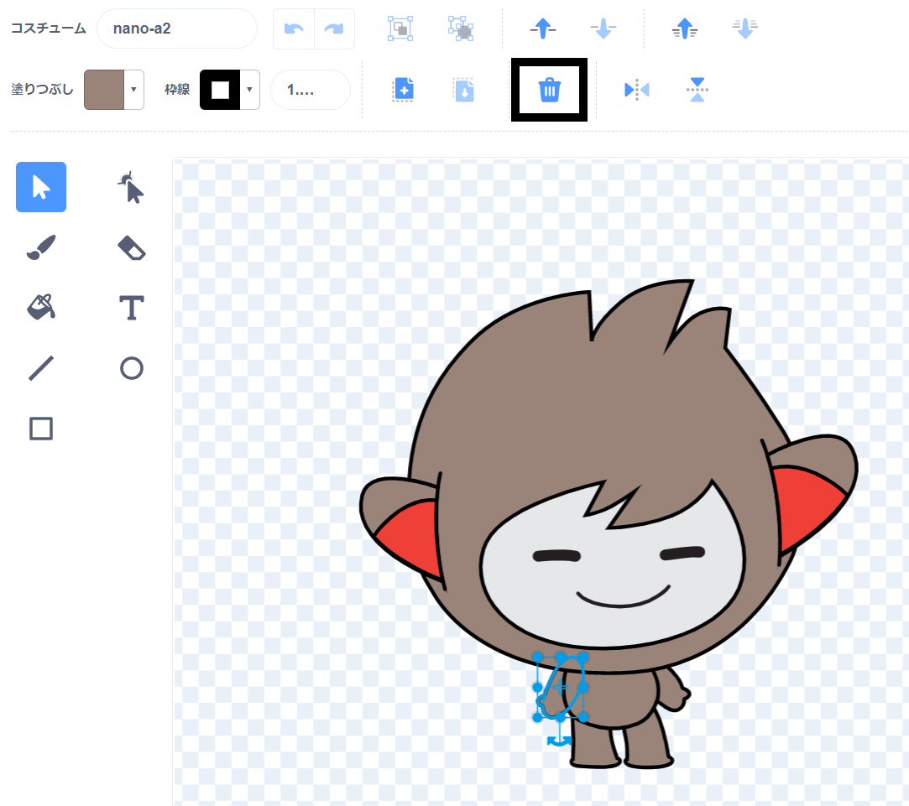
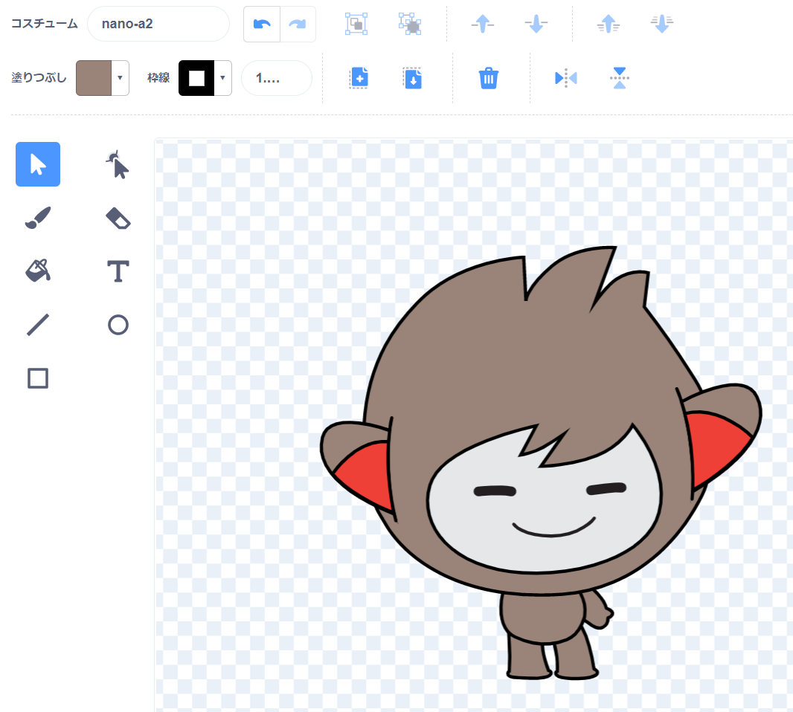
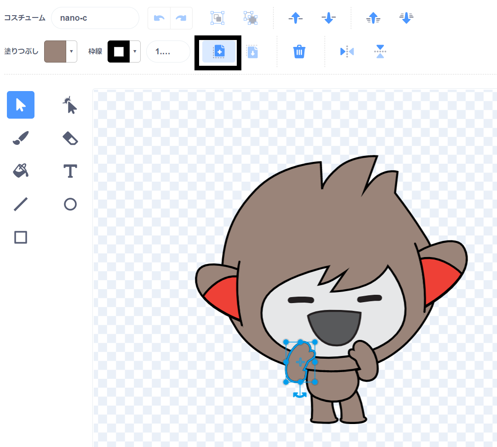

スプライトの **コスチューム** タブをクリックします。

**ヒント: **編集 (へんしゅう) したいコスチュームを複製 (ふくせい) しましょう。こうすることで、元のコスチュームを引きつづき使用できます。 複製するには、コスチュームを右クリック（またはタブレットではタップアンドホールド(長押し)）して、 **複製**を選択 (せんたく) します。 これで、コスチュームのコピーが作成されます。


コスチュームのいらない部分を削除 (さくじょ) するには、その部分をクリックして選択し、 **削除**をクリックします。



パーツを削除した複製したコスチュームは、次のようになります。



**ヒント: ** ペイントエディタでまちがえた場合は、 **元に戻す** (もどす) をクリックしてください。 

追加 (ついか) したいパーツが使われているコスチュームに行き、使いたいパーツをクリックしてから**コピー**をクリックします。



**コスチューム**タブにないコスチュームのパーツを使いたい場合、まずはそのコスチュームをスプライトに追加する必要があります。 **コスチュームを選ぶ** (えらぶ) をクリックし、パーツを使いたいコスチュームをクリックしてスプライトに追加します。


使いたい部分をコピーしたら複製したコスチュームにもどり、 **貼り付け** (はりつけ) をクリックします。 複製されたコスチュームは次のようになります。


次に **コード** タブに切りかえます。 コードブロックで新しいコスチュームを使用できるようになります。

```blocks3
switch costume to [nano-a2 v] // the edited costume
```
