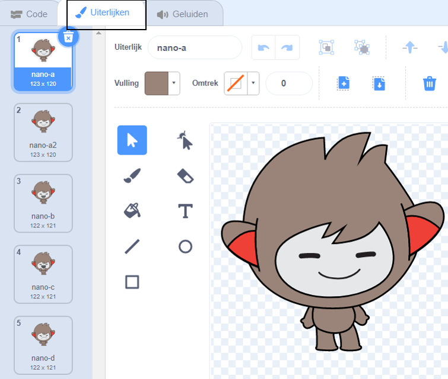

## Kopieer delen tussen sprite-uiterlijken

Klik op het **Uiterlijken** tabblad voor jouw sprite:



**Tip:** Kopieer het uiterlijk dat je wilt aanpassen - zo kun je nog steeds het origineel blijven gebruiken. Klik met de rechtermuisknop (of tik en houd vast op een tablet) op het uiterlijk en kies 'dupliceren'. Je hebt nu een tweede kopie van het uiterlijk.


Om delen van het uiterlijk te verwijderen die je niet nodig hebt, klik je op dat deel om het te selecteren en klik dan op **Verwijder**.


Het gedupliceerde uiterlijk met delen verwijderd zou er ongeveer zo uit moeten zien:


**Tip:** Als je een foutje in de Teken-editor maakt, kun je op Ongedaan maken klikken 

Ga naar het uiterlijk met het detail dat je toe wilt voegen, klik op het deel dat je nodig hebt en klik dan op **Kopie maken**.


Als je een uiterlijk toe wilt voegen dat nog niet in het **Uiterlijken** tabblad staat, klik dan op de **Kies een uiterlijk** knop. Zoek dan het uiterlijk dat je wilt en klik erop om het aan je sprite toe te voegen.


Ga terug naar het gedupliceerde uiterlijk en klik op **Plakken**. Het gedupliceerde uiterlijk zou er ongeveer zo uit moeten zien:


Ga nu naar het **Code** tabblad en je kunt je nieuwe uiterlijk in de codeblokken gebruiken:

```blocks3
switch costume to [nano-a2 v] // the edited costume
```
