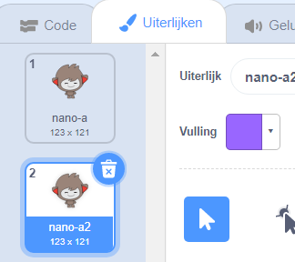

Klik op het **Uiterlijken** tabblad voor jouw sprite.

**Tip:** Kopieer het uiterlijk dat je wilt aanpassen - zo kun je nog steeds het origineel blijven gebruiken. Om dit te doen, klik met de rechtermuisknop (of op een tablet, tik en houd vast) op het uiterlijk en kies **dupliceren**. Je hebt nu een kopie van het uiterlijk:




Om delen van het uiterlijk te verwijderen die je niet nodig hebt, klik je op dat deel om het te selecteren en klik dan op **Verwijder**:


Het gedupliceerde uiterlijk met delen verwijderd zou er ongeveer zo uit moeten zien:


**Tip:** Als je een foutje in de Teken-editor maakt, kun je op **Ongedaan** maken klikken: 

Ga naar het uiterlijk met het detail dat je toe wilt voegen, klik op het deel dat je nodig hebt en klik dan op **Kopie maken**:


Als je een onderdeel van een uiterlijk wilt toevoegen dat nog niet in het **Uiterlijken** tabblad staat, moet je het uiterlijk eerst aan je sprite toevoegen. Klik op het **Kies een uiterlijk** icoon, zoek het uiterlijk dat je wilt en klik erop om het aan je sprite toe te voegen:


Wanneer je het onderdeel dat je nodig hebt hebt gekopieerd, ga je terug naar het gedupliceerde uiterlijk en klik je op **Plakken**. Het gedupliceerde uiterlijk zou er ongeveer zo uit moeten zien:


Schakel nu over naar het tabblad **Code**. Je kunt het nieuwe uiterlijk in je codeblokken gebruiken:

```blocks3
switch costume to [nano-a2 v] // het bewerkte uiterlijk
```
