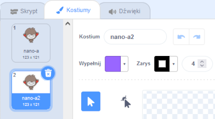

Kliknij zakładkę **Kostiumy** dla twojego duszka.

**Wskazówka:** Powiel kostium, który chcesz edytować - aby w razie potrzeby można było użyć oryginalnego kostiumu, jeśli będziesz potrzebowała. Aby to zrobić, kliknij prawym przyciskiem myszy (lub na tablecie naciśnij i przytrzymaj) kostium i wybierz **duplikuj**. Otrzymasz teraz kopię kostiumu:




Aby usunąć część kostiumu, której już nie potrzebujesz, kliknij część, aby ją zaznaczyć, a następnie kliknij **Usuń**:


Powielony kostium z usuniętymi częściami powinien wyglądać mniej więcej tak:


**Wskazówka:** Jeśli popełnisz błąd w Edytorze graficznym, możesz kliknąć **Cofnij**: 

Przejdź do kostiumu z częścią, którą chcesz dodać i kliknij potrzebną część, a następnie kliknij **Kopiuj**:


Jeśli chcesz dodać część z kostiumu, która nie jest jeszcze pokazana w **Kostiumy**, musisz najpierw dodać kostium do swojego duszka. Kliknij **Wybierz kostium**, a następnie znajdź żądany kostium i kliknij go, aby dodać go do swojego duszka:


Po skopiowaniu potrzebnej części wróć do zduplikowanego kostiumu i kliknij **Wklej**. Zduplikowany kostium powinien teraz wyglądać mniej więcej tak:


Teraz przejdź do zakładki **Skrypt**. Będziesz mógł użyć nowego kostiumu w swoich blokach kodu:

```blocks3
switch costume to [nano-a2 v] // the edited costume
```
