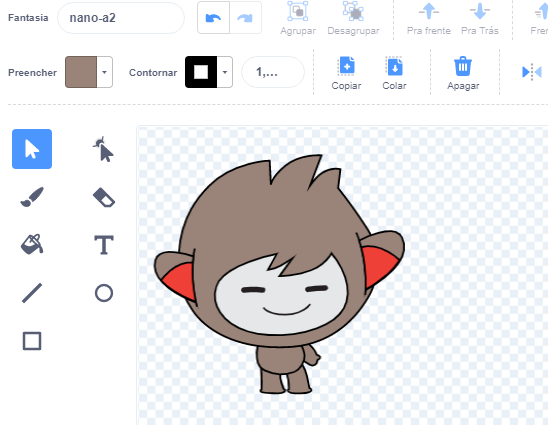

Clique na aba **Fantasias** para o seu ator.

**Dica:** Duplique a fantasia que você deseja editar— assim você ainda pode usar a fantasia original, caso precise. Para fazer isso, clique com o botão direito do mouse (se estiver usando um tablet, pressione e segure) na fantasia e escolha **duplicar**. Assim você terá uma cópia da fantasia:


Para remover qualquer parte de uma fantasia que você não precisa mais, clique na parte desejada para selecioná-la, em seguida clique em **Deletar**:


A fantasia duplicada com as partes removidas deve ser parecido com isto:



**Dica:** Se você cometer um erro no editor do Paint, pode clicar em **Desfazer**: 

Vá para fantasia com a parte que você deseja adicionar e clique na parte que você precisa, em seguida clique em **Copiar**:


Se você deseja adicionar uma parte de uma fantasia que ainda não está aparecendo na aba **Fantasias**, primeiro você precisa adicionar a fantasia para o seu ator. Clique no ícone **Escolha uma fantasia**, em seguida escolha a fantasia que você deseja e clique nela para adicioná-la em seu ator:


Quando você tiver copiado a parte que você precisa, volte para a fantasia duplicada e clique em **Colar**. A fantasia duplicada deve ser parecido com isto:


Agora, mude para a guia **Código**. Você poderá usar a nova fantasia em seu blocos de código:

```blocks3
switch costume to [nano-a2 v] // the edited costume
```
