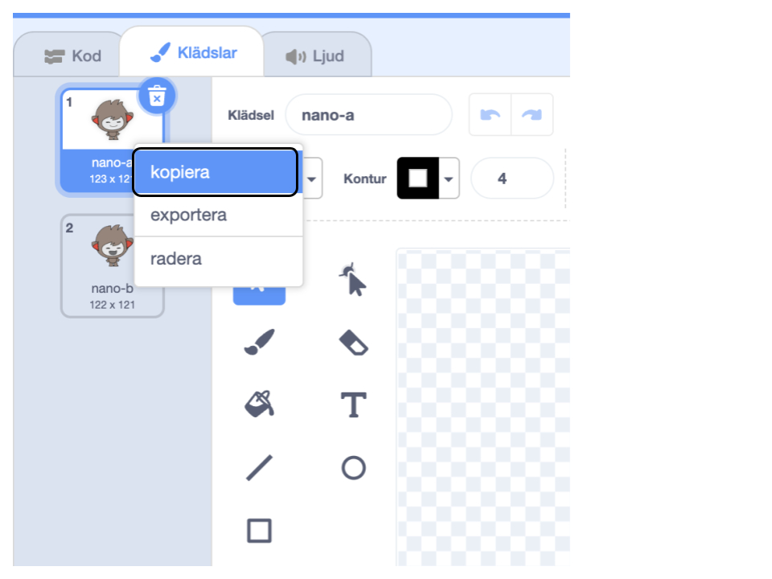
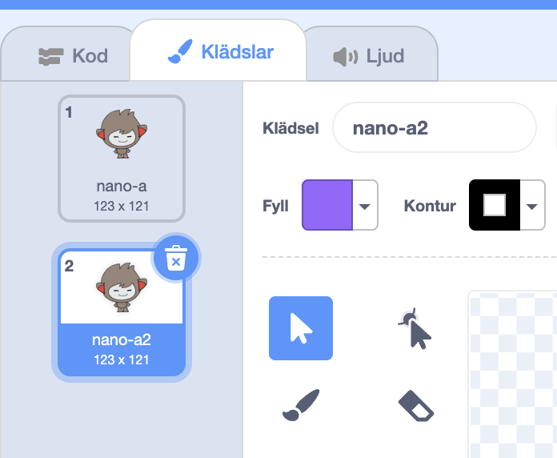
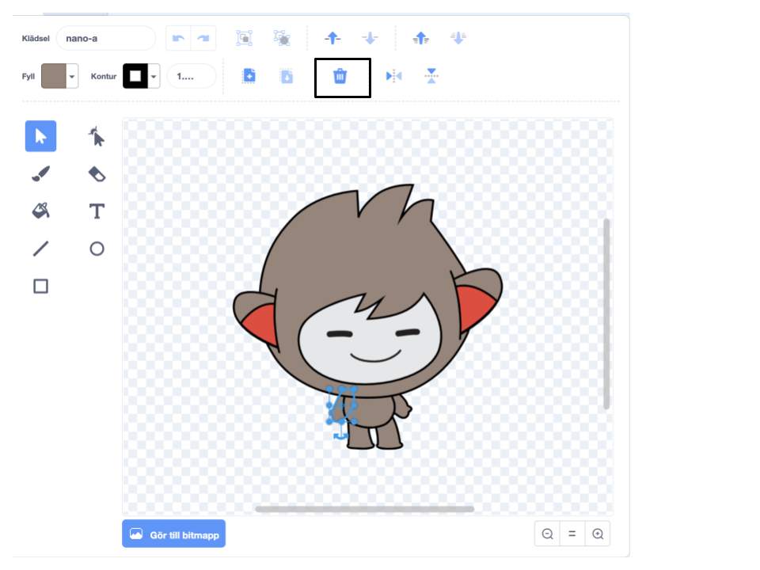
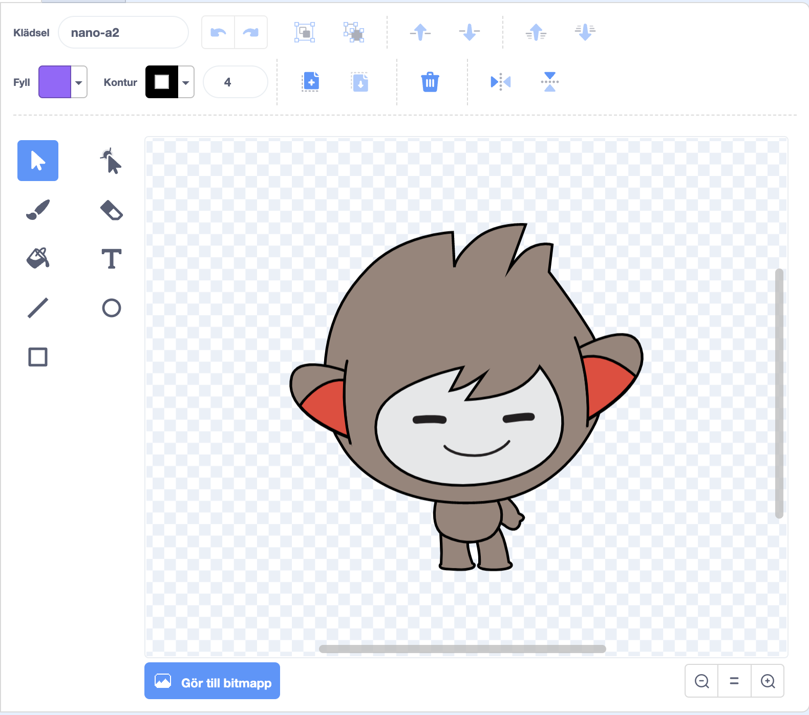
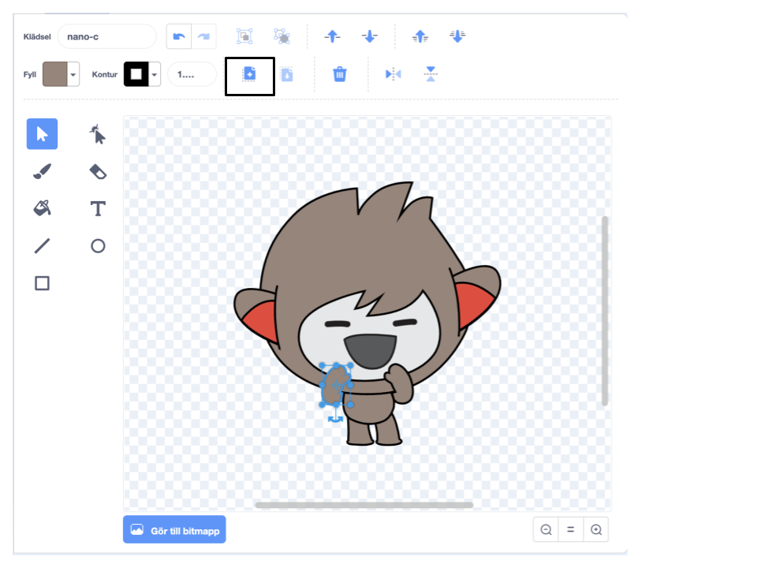
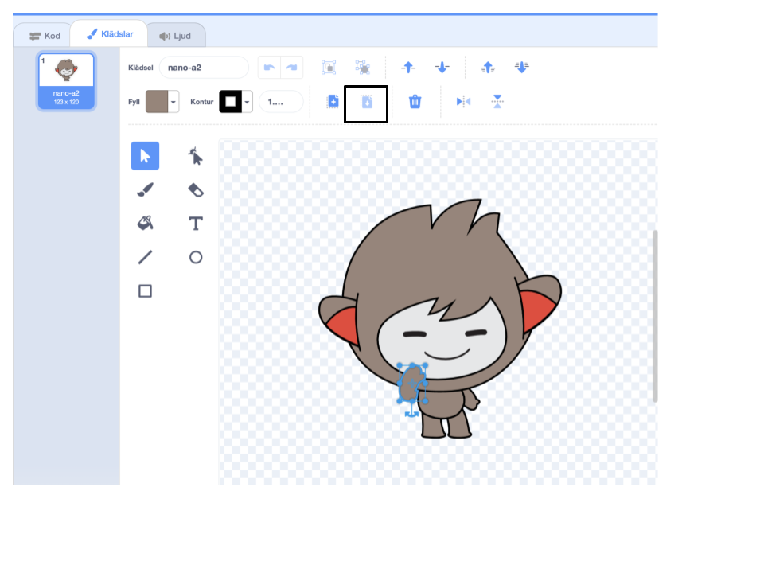

Klicka på din sprajts **Klädsel**flik.

**Tips:** Duplicera klädseln som du vill redigera så att du fortfarande kan använda originalklädseln om du behöver. För att göra detta, högerklicka (eller på en surfplatta, tryck och håll kvar) på klädseln och välj **duplicera**. Du kommer nu att ha en kopia av klädseln:





För att ta bort någon del av klädseln som du inte behöver längre, klicka på delen för att välja den och klicka sedan på **Ta bort**:



Den duplicerade klädseln med borttagna delar ska se ut ungefär så här:



**Tips:** Om du gör ett misstag i målarredigeraren kan du klicka på **Ångra**: 

Välj klädseln med den del du vill lägga till och klicka på den del du behöver, klicka sedan på **Kopiera**:



Om du vill lägga till en del från en klädsel som inte redan finns i **klädsel**fliken måste du först lägga till klädseln till din sprajt. Klicka på **"Välj en klädsel"**-ikonen, hitta den klädsel du vill ha och klicka på den för att lägga till den till din sprajt:


När du har kopierat den del du behöver, gå tillbaka till den kopierade klädseln och klicka på **Klistra in**. Den duplicerade klädseln ska nu se ut ungefär så här:



Byt nu till **Kod**fliken. Du kommer att kunna använda den nya klädseln i dina kodblock:

```blocks3
switch costume to [nano-a2 v] // the edited costume
```
