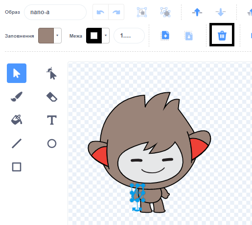

Клацни на вкладку **Образи** для твого спрайта.

**Порада:** продублюй образ, який ти хочеш відредагувати; таким чином, ти зможеш використати оригінальний образ при необхідності. Для цього клацни правою кнопкою миші (або на планшеті тапни й утримуй) по образу та вибери **дублювати**. Тепер у тебе буде копія цього образа:


Щоб видалити будь-яку частину образу, яка тобі більше не потрібна, клацни по цій частині, щоб виділити її, а потім натисни **Вилучити**:



Продубльований образ з видаленими частинами має виглядати приблизно так:


**Порада:** якщо в Редакторі малювання допущена помилка, можеш натиснути **Скасувати**: 

Перейди до образу з частиною, яку ти хочеш додати та натисни на потрібну тобі частину, після чого натисни **Копіювати**:


Якщо ти хочеш додати частину з образа, який ще не показаний на вкладці **Образи**, тобі потрібно спочатку додати образ до спрайта. Клацни на іконку **Обрати образ**, потім знайди потрібний тобі образ і клацни на нього, щоб додати його до спрайта:


Коли ти скопіював потрібну тобі частину, повернись до продубльованого образу і натисни **Вставити**. Дублікат образу тепер має виглядати приблизно так:


Тепер перейди на вкладку **Код**. Ти можеш використовувати новий образ у своїх блоках коду:

```blocks3
switch costume to [nano-a2 v] // відредагований образ
```
